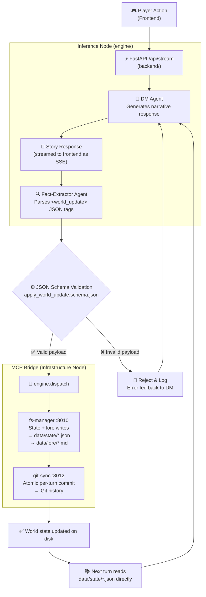

# Project Sentinel

[](https://www.apache.org/licenses/LICENSE-2.0)
[](https://www.python.org/downloads/)
[](https://nodejs.org/)
[](CONTRIBUTING.md)
[](https://modelcontextprotocol.io)

**What if your RPG world kept evolving while you slept?**

Project Sentinel is an autonomous world engine that keeps a living, breathing RPG universe running without a human dungeon master at the wheel. Every player action flows through an LLM storytelling agent, gets parsed for world-state changes by a Fact-Extractor, and is committed to a Git-backed infrastructure — automatically, atomically, and without touching a single file by hand.

The secret: the Inference Node is **never granted direct filesystem access**. All world mutations route through local MCP servers that validate every write against JSON Schema contracts before anything persists. The result is an AI that can run your campaign for months, maintain narrative consistency across thousands of turns, and never corrupt your world state.

> **The user's only interface is the narrative. The system handles everything else.**

---

## How It Works: Agentic Architecture

Sentinel is built on a pattern called **LLM Orchestration over a Schema-Enforced Infrastructure**. Three specialist agents — a Dungeon Master, a Fact-Extractor, and a Lorekeeper — run as an agentic loop on the Inference Node. They talk to each other through structured prompts, not function calls.

The Inference Node never touches files. When the DM generates a story beat that changes the world, the Fact-Extractor agent parses the response and emits a structured `<world_update>` JSON payload. That payload travels across the MCP Bridge to the Infrastructure Node, where it is validated against a Draft 2020-12 JSON Schema before a single byte is written to disk.

This is **Prompt-Driven Development** at the infrastructure level: the narrative is the API, the schema is the contract, and the MCP server is the enforcer. Contributors can literally describe a new game mechanic in natural language to their LLM of choice, and if the generated MCP server adheres to the schema contract, the engine picks it up automatically — Zero-Touch File I/O by design.

---

## Architecture Skeleton

Per **[ADR 0001](docs/adr/0001-data-canonical-source-of-truth.md)**, canonical world state lives in `data/state/*.json` + `data/lore/*.md` under git. The production backend is FastAPI (`backend/`) — it reads from `data/` directly and dispatches every write through `engine/` → `fs-manager` → `git-sync`. No database queries sit in the turn loop.

Sentinel operates on a strict separation of concerns to enable seamless remote play via a Tailscale mesh network.

1. **Inference Node** (`/engine`): A pure-Python package that will house the DM, Fact-Extractor, and Lorekeeper agents. It evaluates user input, queries the world state, and outputs rich narrative alongside machine-readable `<world_update>` tags. Currently scaffolding only — see `engine/README.md`.
2. **Infrastructure Node** (`/infrastructure` + `/mcp-servers`): ChromaDB (for future RAG / Lorekeeper), the git-backed hybrid filesystem under `data/`, and the two MCP servers that gate all writes.
3. **The MCP Bridge** (`/mcp-servers`): The Inference Node *never* touches files directly. It issues structured requests to local MCP servers on the Infrastructure Node, which validate and execute every filesystem and git operation.

```text
project-sentinel/
├── data/                      # Canonical world state (ADR 0001)
│   ├── lore/                  # Human-readable narrative (Markdown)
│   │   ├── core/              # Core team content
│   │   └── community/         # Community packs (additive-only)
│   └── state/                 # Machine-readable current world state (JSON)
│       ├── core/              # Core entities, factions, sessions
│       └── community/         # Community-pack state
├── engine/                    # Inference Node (pure-Python, scaffolding)
│   ├── types.py               # Config, WorldContext, DMTurnInput/Result
│   ├── schema.py              # apply_world_update.schema.json loader + validator
│   ├── llm.py                 # OpenAI client wrapper
│   ├── prompts/dm.py          # DM system prompt
│   ├── agents/                # dm.py, fact_extractor.py (stubs)
│   └── dispatch/              # httpx clients for fs-manager + git-sync
├── backend/                   # FastAPI production backend (:8001)
│   ├── main.py                # App factory, uvicorn entry
│   ├── routes/                # /healthz, /api/session/new, /api/stream
│   └── state/                 # data/ readers: world_context, sessions
├── mcp-servers/               # The MCP Bridge
│   ├── fs-manager/            # :8010 — schema-validated filesystem writes
│   └── git-sync/              # :8012 — atomic per-turn git commits
├── infrastructure/            # Docker Compose (ChromaDB) + .env template
├── schemas/                   # Shared JSON Schema contracts (Draft 2020-12)
├── apps/sentinel-ui/          # React 19 + Vite + Tailwind v4 frontend
├── docs/
│   ├── BACKLOG.md             # Open work items
│   ├── ROADMAP.md             # Near-term execution plan
│   ├── VISION.md              # Long-term direction
│   ├── QUICKSTART.md          # 5-minute first-run walkthrough
│   └── adr/                   # Architecture decision records
├── ARCHITECTURE.md            # Core vs. Community framework and namespace rules
├── CONTRIBUTING.md            # Contributor pathways
├── folder_structure.json      # Machine-readable repo manifest
└── README.md
```

---

## The Core Loop



1. **Action**: Player submits a turn through the frontend, which hits `POST /api/stream`.
2. **Narrative**: The DM agent generates a streamed story response.
3. **Extraction**: The Fact-Extractor parses `<world_update>` tags out of the response.
4. **Validation**: The payload is checked against `apply_world_update.schema.json`. Invalid payloads are rejected and fed back to the DM (a first-class control-flow path, not an error case).
5. **Dispatch**: `engine.dispatch.apply_world_update` calls fs-manager to mutate `data/state/*.json` and `data/lore/*.md`.
6. **Sync**: `engine.dispatch.commit_snapshot` calls git-sync to commit the turn atomically.
7. **Next turn**: The backend re-reads `data/state/*.json` directly — no cache layer, no database round-trip.

---

## Getting Started (Bridge Initialization)

### Prerequisites

| Tool | Version | Install |
|------|---------|---------|
| Docker + Docker Compose | Latest | [docs.docker.com](https://docs.docker.com/get-docker/) |
| Python | 3.11+ | [python.org](https://www.python.org/downloads/) |
| Node.js + pnpm | Node 24, pnpm 10 | [nodejs.org](https://nodejs.org/) |
| just | 1.x | `brew install just` · `cargo install just` · `winget install Casey.Just` |
| chezmoi | 2.x | `brew install chezmoi` · `sh -c "$(curl -fsLS get.chezmoi.io)"` |
| Tailscale | Any | **Optional** — only needed for multi-machine deployments |

### 1. Generate your OS-aware environment config

```bash
just env
```

Chezmoi reads `.chezmoi/dot_infrastructure/dot_env.tmpl` and writes
`infrastructure/.env` with the correct Docker socket path and Python binary
for your OS.

### 2. Install all dependencies

```bash
just install
```

Runs `pnpm install --frozen-lockfile` and installs Python deps for the MCP
servers, the FastAPI backend, the engine package, and the pytest suite.

### 3. Spin up the stack

```bash
just start
```

Starts ChromaDB via Docker Compose, polls until it's healthy, then launches
fs-manager and git-sync in the background.

### 4. Confirm everything is running

```bash
just health
```

Prints a pass/fail table for every service and your git remote/branch state.
Exits 0 if all checks pass.

### Initialize the Inference Loop

> **Status: not yet implemented.** The Inference Node — the orchestrator loop
> that turns DM narrative into validated `<world_update>` payloads and dispatches
> them across the MCP Bridge — lives in `engine/` as scaffolding today. Agent
> entry points raise `NotImplementedError`. Track progress in `docs/BACKLOG.md`.

---

## Core Principles

- **Automation First** — The world updates itself. Zero manual file handling.
- **Modularity Always** — Every subsystem is independently replaceable.
- **Human-Readable** — Lore stored in Markdown; state stored in JSON.
- **AI-Native** — Personas, pipelines, and tools designed for LLM orchestration.
- **Schema-Enforced** — The Inference Node is *never* granted raw filesystem access.
- **Community-Friendly** — Plug-and-play via the `community.json` gateway manifest.

---

## Live Demo

A reference implementation of Project Sentinel is available in this repository:

- **Frontend** — `apps/sentinel-ui/` (`@sentinel/ui`) — React 19 + Vite + Tailwind v4, diegetic design system, World Creation flow, DM Persona system. Talks to the FastAPI backend via `fetch`-based SSE streaming. *(Note: the 1.0 frontend stack is not yet settled — see `docs/VISION.md`.)*
- **Backend** — `backend/` — FastAPI on `:8001`. Reads state directly from `data/state/*.json` per ADR 0001; calls the `engine/` package for DM turn handling and routes every write through `engine → fs-manager → git-sync`. No ORM, no database queries.
- **Inference engine** — `engine/` — pure-Python package housing the DM agent, Fact-Extractor, and HTTP dispatcher for the MCP Bridge. Framework-agnostic; boundary-enforced.

---

## Built By the Hive

Project Sentinel v0.1 was vibe-coded and architected through a coalition of AI tools. We think that's worth celebrating.

| Contributor | Role in Genesis |
|---|---|
| **Google Gemini** (AI Studio) | System architecture, schema design, and the Sentinel Porter / Airlock specification |
| **Anthropic Claude** | CONTRIBUTING guidelines, security policy, and MCP server hardening |
| **OpenAI** | DM persona prompts, Fact-Extractor agent definitions, and the `gpt-5-mini` reference implementation |
| **Replit** | Original full-stack scaffolding and live development environment (migrated away; see `docs/BACKLOG.md`) |
| **GitHub Copilot** | Inline completions, test generation, and TypeScript library boilerplate |

In 2026, the best open-source projects are human-directed and AI-synthesized. Sentinel is proof of concept. The humans set the vision, held the architecture accountable, and enforced the schema contracts. The AI did the heavy lifting.

**You are welcome to do the same.** See [The Vibe Coder's Guide](CONTRIBUTING.md#4-the-vibe-coders-guide) in CONTRIBUTING.md.

---

## License & Legal

Project Sentinel is licensed under the **Apache License 2.0**. In plain English:

- You can use, modify, and distribute this project (including for commercial use).
- The project is provided **"AS IS"**, without warranties; maintainers and contributors are not liable for damages resulting from use.
- Contributors grant a patent license for their contributions under Apache 2.0, with patent-retaliation protections if someone files patent litigation over the project.

We may offer future versions or separate editions under additional licensing terms (including commercial terms). This repository remains available under Apache 2.0 unless explicitly stated otherwise for a specific release or component.

See [`LICENSE`](LICENSE) for the legally binding terms.
